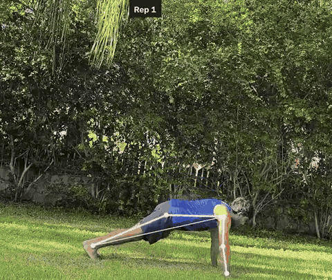
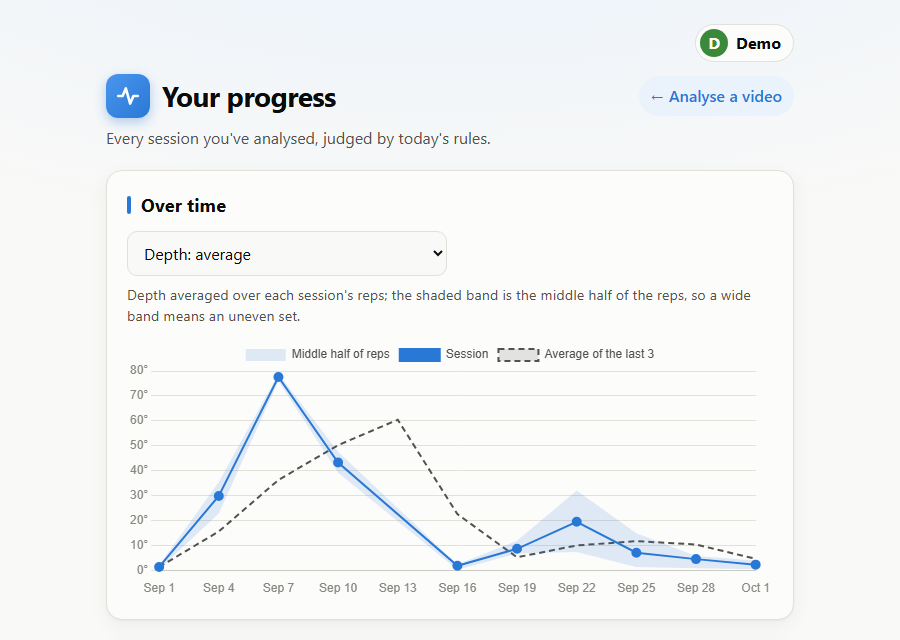

# Form Coach

[](https://github.com/TalGvili/form-coach/actions/workflows/ci.yml)
[](https://talgvili.github.io/form-coach/)

A web app that watches a phone video of your push-ups and gives feedback on every rep: it counts
reps, checks four faults (depth, sagging hips, piked hips, arms not locked out), shows you each
fault on an annotated video, and tracks your progress across sessions.

**[Try the demo →](https://talgvili.github.io/form-coach/)** a real analysis and history,
nothing to install.

<p align="center">
  
</p>
<p align="center"><sub>Rep 1 reaches full depth. Rep 2 doesn't, so the video pauses at its
bottom, skeleton in red, and says why.</sub></p>

## What it does

- **Counts reps and checks each one** against four faults, with every threshold in a YAML file
  next to the measurement that justified it.
- **Shows faults where they happen.** The annotated video pauses on each rep with something to
  fix; the rep table's ▶ buttons jump to any rep.
- **Says when it can't tell.** A check whose landmark was outside the frame is reported as "not
  checked", never as a pass.
- **Keeps a history per profile** with progress charts: reps, share of clean reps, depth and a
  fatigue index. History stores measurements, not verdicts, so old sessions are judged by today's
  thresholds.
- **Is evaluated honestly**, on held-out clips chosen before any detection code existed
  ([Results](#results)).

| Report | Progress |
| --- | --- |
|  |  |

## Quick start

With Docker (Python, ffmpeg and the pose model included; the image is about 1.9 GB):

```bash
git clone https://github.com/TalGvili/form-coach.git && cd form-coach
docker build -t form-coach .
docker run -p 127.0.0.1:8000:8000 -v form-coach-data:/app/data form-coach
```

Open `http://localhost:8000`, pick a profile, and upload a side-view video of a few push-ups
(under a minute). The volume keeps your history across restarts. To use it from your phone on the
same Wi-Fi, run with `-p 8000:8000` and open `http://<your computer's IP>:8000`, on a network you
trust: profiles keep people's histories apart but aren't accounts.

Without Docker, see [Running it without Docker](#running-it-without-docker).

## How it works


The slow step, pose estimation, runs once per video; everything after it re-runs from the cache
in a fraction of a second, which is what made tuning against labels practical.

| Module | Job |
| --- | --- |
| `pipeline/landmarks.py` | Runs MediaPipe's `PoseLandmarker` on every frame; caches the landmarks with the video's metadata |
| `pipeline/signals.py` | Per-frame angles: elbow, upper arm, torso tilt, and the hip's signed distance from the shoulder–ankle line; smoothing; the stretch where the body is horizontal |
| `pipeline/reps.py` | Finds each rep (top → bottom → top) and measures it, recording the frame each value came from |
| `pipeline/rules.py` | A rule engine that knows nothing about push-ups: each rule names a metric and its bounds in the YAML; three outcomes, fault, no fault or could not evaluate |
| `pipeline/session.py` | `analyze()` (video → result) and `judge()` (measurements → verdicts): the one path the command line, the web app and the history all use |
| `pipeline/render.py` | Draws the annotated video and reports where each rep starts in it |
| `pipeline/progress.py` | Per-session numbers for the progress chart, computed when asked for |
| `configs/pushup.yaml` | Every threshold, each with the measurement behind it |
| `app/main.py` | FastAPI: upload, annotated video, profiles, history; every refusal turned into a response in one place |
| `app/db.py` | SQLite: profiles, sessions and reps, stored as measurements |
| `app/static/` | The pages: plain HTML and JavaScript with Chart.js |
| `eval/` | Evaluation against the hand labels, and the log of every tuning experiment |

A few decisions worth knowing:

- **The analysis knows nothing about the web, and the web layer knows nothing about angles.** The
  command line and the web app call the same `analyze()`.
- **"Could not evaluate" is a third outcome.** `NaN > 15` is `False` in Python, so without it a
  rep with the wrist out of frame would silently pass the lockout check.
- **Measurements are stored, verdicts are computed.** Changing a threshold re-judges the whole
  history consistently instead of mixing old and new verdicts.
- **The held-out clips were chosen before any detection code**, and evaluated once.

## Results

Measured by `python -m eval.evaluate`. Every tuning step, with its numbers, is in
[`eval/EXPERIMENTS.md`](eval/EXPERIMENTS.md).

### Held-out clips (run once, after tuning was finished)

Rep counting was correct on 4 of the 6 clips. The other two are left out of the per-rep
scoring, since a missing or extra rep misaligns every rep after it: **36 reps from 4 clips.**

| Fault | Detected | Missed | False alarms | Precision | Recall |
| --- | --- | --- | --- | --- | --- |
| `shallow` | 11 / 11 | 0 | 8 | 0.58 | 1.00 |
| `hip_sag` | 8 / 8 | 0 | 3 | 0.73 | 1.00 |
| `hip_pike` | 8 / 8 | 0 | 0 | 1.00 | 1.00 |
| `no_lockout` | – | – | – | – | – |

- **Nothing labelled was missed.** Every error is a false alarm or a counting failure.
- **`no_lockout` has no held-out result:** its only held-out clip was one of the two miscounted.
- **`shallow` is the weakest.** Depth is the angle of the upper arm seen from the side, and
  posture changes how that angle looks on camera. 5 of its 8 false alarms come from the held-out
  sag clip, where full-depth reps read 16–21°; only 4 full-depth sag reps were left for tuning.
  The other 3 are piked reps, a known limitation (below), and the feedback hides them.
- **Counting failed on the off-angle clip** (the arm's movement looked too small to be reps)
  **and on the mirrored no-lockout clip**: 2 extra reps, one of them getting up off the floor
  after the set, the other a hesitation between two reps.
- Per person: person B, tuned on one clip, scored `shallow` 11 / 11 with no false alarms; all 3
  `hip_sag` false alarms were also theirs.

With 36 reps from 4 clips, one clip's quirk moves a whole row of this table. These numbers say
the method works on unseen video of these two people for pike, mostly for depth and sag, and
are untested for lockout.

### Training clips, for comparison

94 reps from 12 clips. Tuned on these, and three labels were corrected during tuning, so these
are optimistic by construction.

| Fault | Precision | Recall |
| --- | --- | --- |
| `shallow` | 0.97 | 1.00 |
| `hip_sag` | 1.00 | 0.91 |
| `hip_pike` | 1.00 | 1.00 |
| `no_lockout` | 1.00 | 1.00 |

## What was hard

The full log, with numbers for every change, is in [`eval/EXPERIMENTS.md`](eval/EXPERIMENTS.md).

- **Which signal to count reps on.** Measured on 14 clips: the upper-arm angle counted 9
  correctly, the elbow angle 8, shoulder height 7. Height is an absolute position, so the body
  drifting in the frame swamps the movement; angles don't move with the body.
- **The first and last rep swallowed getting down and getting up.** Their hips read 33–103° of
  "pike" against 7–13° for real reps. Cutting them at the clip's typical descent and ascent fixed
  the worst (one rep, 103° → 1°); measuring the hips only while the arms move then took pike
  false alarms from 12 to 5 without losing a real one.
- **Some things can't be separated by any threshold.** A failed rep that got halfway up climbed
  back 0.64 of a typical rep; a completed rep without lockout, 0.63. That's documented as a
  limitation instead of tuned around.
- **Depth on camera isn't depth.** Smoothing rounded off the bottom of narrow dips (reading the
  raw signal there cut false alarms from 18 to 13), and elbows flaring toward the camera make
  full-depth reps read up to 13.8°. The threshold, 15°, leans toward missing a shallow rep rather
  than telling someone a good rep wasn't deep enough.
- **The held-out run was humbling.** Depth's precision went from 0.97 on the tuning clips to 0.58
  on unseen ones, mostly on full-depth reps with sagging hips, a combination the tuning clips
  barely had. A fix was considered after seeing those clips and rejected: adopting it would have
  turned them into training data.
- **Engineering surprises.** Pauses made the annotated video longer than the original, so "jump
  to rep 5" needed times counted from the frames actually written. Rendering went from 35 s to
  13.5 s by piping frames straight into ffmpeg instead of encoding twice. In Docker, the first
  real upload failed on a missing graphics library that no test exercised; CI now loads it.

## Dataset and labeling

20 side-view clips of push-ups by two people (person A in clip01–17, person B in
clip18–20), labeled one row per rep. `data/labeling_sheet.md` is the
hand-written record; `data/labels.csv` is generated from it by `scripts/labels_from_md.py`
and regenerated after every relabel, so the two never drift apart.

158 reps in total:

| Label | Reps | Clips |
| --- | --- | --- |
| `shallow` | 51 | 8 |
| `hip_sag` | 33 | 6 |
| `hip_pike` | 27 | 5 |
| `no_lockout` | 26 | 5 |
| clean (no fault) | 49 | 10 |

A rep can carry more than one fault, so the fault counts overlap and do not sum to 158. The
clip count matters as much as the rep count: reps within one clip share lighting, camera
position and body proportions, so they are not independent samples.

### Labeling rules

Label what is visible in the video, not what the rep was meant to be.

| Column | Label 1 when… |
| --- | --- |
| `shallow` | At the bottom, the shoulder doesn't drop to elbow height (the upper arm never reaches parallel to the floor) |
| `hip_sag` | The hips visibly drop below the shoulder–ankle line for a noticeable part of the rep. Counts only during the movement itself (the descent and the push back up), not while pausing at the top between reps |
| `hip_pike` | The hips visibly rise above the shoulder–ankle line (the body forms an inverted V) |
| `no_lockout` | At the top, the arms stop visibly short of straight. A clear bend that should be corrected, not a slight softness in the elbows |

A rep counts only when the person returns to the top position. Failed final reps are excluded
from the labels; there are 3 in this dataset.

Borderline reps are labeled using the rule anyway, with a note in the `notes` column.

During tuning, three training labels were changed after re-watching the rep against the
written rule (clip14 rep 7, clip06 reps 5 and 7); each change and its reason is in
`eval/EXPERIMENTS.md`. All three moved toward the detector, so the training numbers are
somewhat optimistic. Held-out labels were never revisited.

### Fault isolation

Faults were also filmed on their own — piking and sagging with full depth, shallow reps with a
straight body — so each detector can be checked against its own fault rather than against faults
that happen to occur together. Reps carrying exactly one fault:

| Fault | Isolated reps |
| --- | --- |
| `no_lockout` | 26 / 26 |
| `hip_pike` | 20 / 27 |
| `shallow` | 23 / 51 |
| `hip_sag` | 12 / 33 |

`hip_sag` is the weakest here: 21 of its 33 reps also carry `shallow`, so only 12 reps across 2
clips show sag with depth otherwise correct. This is the known soft spot in the dataset.

### Held-out evaluation set

Six clips are held out and were chosen before any detection code was written:

**clip10** (sag) · **clip12** (clean, off-angle) · **clip15** (no lockout, mirrored) ·
**clip17** (pike) · **clip18** (shallow) · **clip20** (clean, mirrored)

49 of 158 reps, 31%. Every fault appears at least once. Thresholds and smoothing parameters are
tuned on the other 14 clips only; the final evaluation table is reported on these six, so the
numbers describe performance on video that was never used for tuning.

One cost is worth stating: clip10 holds 8 of the 12 isolated `hip_sag` reps, leaving 4 for
tuning. A test set with only one sag rep would have been worse.

Person B's clips split as one for tuning (clip19) and two held out (clip18, clip20), so the
held-out results are also reported per person: 20 reps from person B against 29 from person A.

## Limitations

What the method structurally cannot do, and why tuning won't fix it.

- **Two people, with the faults performed on purpose.** Body proportions, clothing, and the
  way a fault looks when it happens unintentionally all change the landmarks, and two people
  barely sample that. The second person appears in one tuning clip and two held-out clips, so
  the held-out results say something about a person the thresholds were barely tuned on, but
  nothing about people in general. Only filming more people can fix this; tuning can't.
- **A lower-back arch while the hips stay in line can't be measured.** The pose model has no
  landmarks along the spine, only shoulders and hips. Sag and pike are detectable because they
  move the hip landmark itself off the shoulder–ankle line; an arch does not.
- **Results can differ slightly between platforms.** MediaPipe's builds for Windows and Linux
  compute landmarks a few pixels apart (a median of 2.6 px on one clip), and in video mode each
  frame's tracking starts from the previous one. A value sitting on a hard line can flip: one
  clip's elbow was at y = 1079 of 1080 on Windows and 1084 in the Linux container, so one depth
  check became "could not evaluate". The evaluation numbers above were measured on Windows.
- **Side view only.** Every measurement assumes the camera is roughly perpendicular to the body,
  at floor-to-hip height, with the whole body in frame. Front or angled views distort the joint
  angles the rules depend on.
- **Landmarks outside the frame make a metric unmeasurable, not wrong.** When the hands leave
  the frame, the pose model still reports a wrist position, extrapolated from the body with no
  warning. Any metric whose extreme value came from such a frame is reported as "could not
  evaluate" instead of a plausible guess. In three training clips the wrists are out of frame
  most of the time, so lockout can't be judged there; in one, the elbow also leaves the frame
  at the bottom of every rep, so depth can't be judged either.
- **Depth isn't reliable on reps with piked hips.** Detecting the pike itself works: it uses
  the hip's position against the shoulder–ankle line, which a side camera sees well. What
  suffers is the depth reading on those reps. With the hips piked, the elbows point toward
  the camera, so the upper arm is seen almost end-on: it shrinks on screen from ~125 to ~50
  pixels, and the angle of such a short segment stays steep even when the shoulder drops
  close to elbow height. A piked rep can therefore read as shallow when it isn't, and one of
  the 26 piked reps in the dataset isn't counted as a rep at all. Two alternatives were tried
  and rejected: a height-based depth signal, and a 3D angle from the pose model's own depth
  estimate. Both fixed the pike clip but miscounted three or four others. Measuring this
  properly needs a second camera or real 3D pose. In practice it matters less than it
  sounds: a piked rep at full depth is essentially a pike push-up, a harder variation, and
  was hard to perform even on purpose while filming.
- **A failed rep can look like a completed rep with bent arms.** A rep counts when the arms
  climb back most of the way relative to the clip's typical rep. A failed rep that gets halfway
  up before collapsing climbed back 0.64 of a typical rep; a completed rep without lockout in
  another clip, 0.63. The arm signal only records how far up the person got, not whether they
  meant to finish, so no threshold separates the two. For the same reason, collapsing flat onto
  the floor and then pushing up to straight arms looks exactly like a rep.
- **A single rep can't be analyzed.** A rep's start and end are cut at the clip's typical
  descent and ascent, learned from the gaps between reps; with one rep there are none, and the
  rep's edges can't be told apart from getting down and getting up. The pipeline reports this
  instead of guessing.
- **Failed reps are not analyzed.** They are excluded from the labels, so nothing measures them.
- **Head position and tempo are measurable but not implemented.** Both are stretch goals.

## Running it without Docker

Python 3.12: MediaPipe doesn't publish wheels for newer versions.

```bash
python -m venv .venv
source .venv/bin/activate          # Windows: .venv\Scripts\activate
pip install -r requirements.txt
```

The pose model is a 9 MB binary, not tracked in git:

```bash
mkdir -p models
curl -o models/pose_landmarker_full.task \
  https://storage.googleapis.com/mediapipe-models/pose_landmarker/pose_landmarker_full/float16/1/pose_landmarker_full.task
```

The web app also needs [ffmpeg](https://ffmpeg.org/download.html) on the `PATH`, to encode the
annotated video as H.264, the codec browsers play (`winget install Gyan.FFmpeg` on Windows,
`brew install ffmpeg` on macOS, `apt install ffmpeg` on Debian/Ubuntu). The command line doesn't
need it.

**Web app:** `uvicorn app.main:app`, then open `http://localhost:8000`. Add `--host 0.0.0.0` to
reach it from a phone on the same Wi-Fi, on a network you trust. Videos must be under a minute
and 500 MB; a 30-second set takes about a minute to analyse. The uploaded video is deleted once
it's analysed: only the annotated copy and the pose landmarks are kept, with the history in
`data/history.db` (SQLite).

**Command line:** prints a per-rep report and saves it as JSON in `data/reports/`; `--render`
also writes the annotated video there.

```bash
python analyze.py path/to/video.mp4 --render
```

**Tests and checks:** `pytest`, `ruff check .`, `ruff format --check .`; CI runs them and builds
the Docker image on every push. Tests use synthetic signals, never the private videos.

The push-up clips are private, so the evaluation can't be re-run from this repo;
`data/labels.csv` and `data/labeling_sheet.md` are included so the labels and the method can be
inspected. The demo is built from one clip by `scripts/make_demo.py`.
