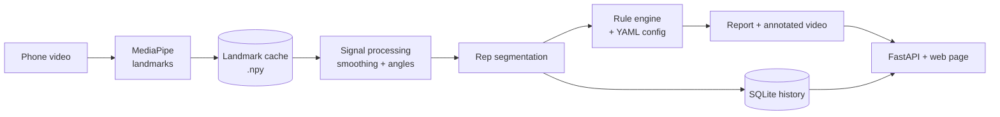

# Form Coach — Step-by-Step Project Guide

Last updated: 2026-09-21

## Overview

A 30-day plan to build a web app that analyzes phone video of push-ups and gives per-rep form feedback, with session history and progress tracking. Each phase ends with a "Done when" test so you know whether you're finished.

The design principle throughout: the analysis pipeline knows nothing about the web, and the web layer knows nothing about angles. Measurements are stored, verdicts are computed from config.



The expensive step (MediaPipe) runs once per video; everything after the cache re-runs in seconds.

### Tech stack

| Technology | Used for | Why this one |
| --- | --- | --- |
| Python 3.11 / 3.12 | Everything | MediaPipe and the scientific stack live here; slightly older version avoids wheel issues |
| Git + GitHub | Version control | Commit history is part of what recruiters see |
| Ruff | Lint + format | One tool, one command, consistent code |
| MediaPipe Tasks | Pose landmarks | Free, CPU-only, no training; use `PoseLandmarker`, not the removed `mp.solutions` |
| OpenCV | Video read/write, drawing | Industry standard for frames and overlays |
| NumPy | Geometry, arrays | Angle math and landmark storage |
| SciPy | Smoothing, peak finding | `savgol_filter` and `find_peaks` do most of Phase 3 |
| Dataclasses | Core data types | Typed, readable structures instead of loose dicts |
| PyYAML | Rule config | Readable, supports comments next to thresholds |
| pandas | Evaluation | Joins predictions to labels in a few lines |
| Matplotlib | Dev plots | For you while tuning, not for users |
| pytest | Tests | Standard, minimal boilerplate |
| GitHub Actions | CI | Runs Ruff + pytest on every push |
| FastAPI + Uvicorn | Web backend | Little code, type-driven validation, free `/docs` page |
| HTML + JS + Chart.js | Frontend | No framework learning curve; the project is about analysis |
| ffmpeg | Video re-encode | Browsers can't play OpenCV's default codec; H.264 fixes it |
| SQLite (`sqlite3`) | Session history | Single file, no server, write real SQL |
| Docker | Packaging | `docker run` works on any machine, ffmpeg and model included |

### Repo structure

```
form-coach/
  pipeline/
    models.py        # dataclasses
    landmarks.py     # MediaPipe extraction + cache
    signals.py       # smoothing, angles
    reps.py          # rep segmentation
    rules.py         # generic rule engine
    render.py        # annotated video
  configs/pushup.yaml
  data/videos/  data/labels.csv  data/cache/
  eval/evaluate.py
  app/main.py  app/db.py  app/static/
  tests/
  analyze.py         # CLI entry point
  Dockerfile
  .github/workflows/ci.yml
  pyproject.toml
  README.md
```

## Phase 0 — Setup (day 1)

Create the repo, environment and empty skeleton so every later phase has a place to land.

1. Create the GitHub repo and clone it.
2. Create a virtual environment with Python 3.11 or 3.12: `python -m venv .venv`.
3. Install the core packages: `pip install mediapipe opencv-python numpy scipy pyyaml pandas matplotlib pytest ruff fastapi uvicorn python-multipart`.
4. Freeze them into `requirements.txt` (Docker will use it in Phase 8).
5. Create the folder structure from the Overview, with empty files.
6. Add a `.gitignore` covering `.venv/`, `data/videos/`, `data/cache/`, `*.task`, `*.db`. Videos and model files don't belong in git.
7. Run `ruff check .` and `ruff format .` once so the habit starts on day one.
8. Write a three-line README: what the project will do, and that it's in progress.

**Done when:** the skeleton is pushed and `ruff check .` passes.

## Phase 1 — Film and label the dataset (days 2–4)

The dataset comes before any analysis code, because every later decision is tuned and judged against it.

1. Film 15–20 clips of about 8 reps each, all from the **same side view**, phone at floor-to-hip height, whole body in frame.
2. Include deliberate faults: clean reps, sagging hips, shallow reps, a mix within one set, one badly lit clip, one slightly off-angle clip.
3. Name them consistently: `clip01.mp4`, `clip02.mp4`, …
4. Watch each clip and fill in `data/labels.csv`, one row per rep:

```csv
clip,rep,hip_sag,shallow
clip01,1,0,0
clip01,2,0,1
clip01,3,1,1
```

Be strict and consistent with your own labeling rule (for example: "shallow = chest clearly above elbow height at the bottom"). Write that rule down in the README; it's part of your evaluation's definition.

**Done when:** every clip has a label row for every rep.

## Phase 2 — Data types, landmarks and visualization (days 3–6)

Define the core data types first, then get landmarks out of video, cache them, and see them.

### Step 1: Core dataclasses (`pipeline/models.py`)

Every phase passes these between modules. Defining them now forces you to decide what the pipeline actually produces, and FastAPI can reuse the same shapes later.

```python
from dataclasses import dataclass

@dataclass(frozen=True)
class VideoInfo:
    path: str
    fps: float
    width: int
    height: int
    n_frames: int

@dataclass(frozen=True)
class Rep:
    index: int
    start_frame: int
    bottom_frame: int
    end_frame: int
    min_elbow_angle: float
    min_hip_angle: float
    hip_sag_duration_s: float

@dataclass(frozen=True)
class Fault:
    rep_index: int
    rule: str
    message: str
    value: float
    frames: tuple[int, int]

@dataclass
class SessionResult:
    video: VideoInfo
    reps: list[Rep]
    faults: list[Fault]
```

`frozen=True` makes measurements immutable: once a rep is measured, nothing downstream can quietly change it. Landmarks themselves stay a NumPy array of shape `(n_frames, 33, 4)` holding x-pixels, y-pixels, z and visibility, with `NaN` rows for frames where no person was detected. Arrays, not dataclasses, because you'll do vectorized math on them.

### Step 2: Extraction (`pipeline/landmarks.py`)

1. Download `pose_landmarker_full.task` from the MediaPipe Pose Landmarker docs page.
2. Write `extract_landmarks(path) -> tuple[VideoInfo, np.ndarray]` using `PoseLandmarker` in `RunningMode.VIDEO`.
3. Convert each frame BGR → RGB before detection, and pass strictly increasing timestamps in milliseconds (`int(i * 1000 / fps)`).
4. Convert normalized x, y to pixels (multiply by width, height) before storing. Normalized coordinates distort angles on non-square video.

### Step 3: Cache

Write `load_or_extract(path)`: if `data/cache/<clip>.npy` exists, load it; otherwise extract and save. MediaPipe is the slow step. With the cache, re-running the whole pipeline over 20 clips takes seconds, which is what makes tuning in Phase 5 practical.

### Step 4: See it

1. In `pipeline/render.py`, draw the skeleton on each frame with `cv2.line` and `cv2.circle` and write an annotated video.
2. Plot the elbow angle (shoulder–elbow–wrist) over time with Matplotlib. Each push-up should appear as a wave dipping to roughly 80° and rising to roughly 170°.
3. Use visibility to pick the side facing the camera; the far arm is hidden and MediaPipe only guesses its position.

**Done when:** `python -m pipeline.landmarks data/videos/clip03.mp4` writes an annotated video and a cache file, and the elbow-angle plot shows clear waves.

## Phase 3 — Signal processing and rep segmentation (days 7–10)

Turn noisy per-frame landmarks into clean angle signals, split them into `Rep` objects, and put tests and CI in place.

### Step 1: Angles and smoothing (`pipeline/signals.py`)

1. Write `angle(a, b, c) -> float`: the angle at point b, via the dot product, with `np.clip` before `arccos`.
2. Write `angle_series(landmarks, joints) -> np.ndarray`: one angle per frame for a joint triple.
3. Fill short gaps of missing frames by linear interpolation (a few frames at most). Leave long gaps as `NaN`.
4. Smooth with `scipy.signal.savgol_filter`. It removes jitter while keeping the shape of the dips better than a moving average. The window length is a parameter you'll tune in Phase 5.

### Step 2: Rep segmentation (`pipeline/reps.py`)

1. Invert the smoothed elbow signal and run `scipy.signal.find_peaks`; each peak is the bottom of a rep.
2. Use `prominence` to ignore small wobbles and `distance` to enforce a minimum time between reps.
3. Define each rep's start and end as the high points between consecutive bottoms.
4. Compute each rep's metrics and return `list[Rep]`.

### Step 3: Tests (`tests/`)

Test with synthetic signals, where you know the right answer exactly:

```python
def test_counts_eight_reps():
    t = np.linspace(0, 16, 480)                 # 16 s at 30 fps
    signal = 125 + 45 * np.cos(2 * np.pi * t / 2)
    signal += np.random.default_rng(0).normal(0, 3, t.size)
    assert len(find_rep_bottoms(signal, fps=30)) == 8
```

Also test `angle` on known triangles (a right angle must return 90). A fixed random seed keeps the test deterministic.

### Step 4: CI (`.github/workflows/ci.yml`)

```yaml
name: ci
on: [push, pull_request]
jobs:
  test:
    runs-on: ubuntu-latest
    steps:
      - uses: actions/checkout@v4
      - uses: actions/setup-python@v5
        with: { python-version: "3.12" }
      - run: pip install -r requirements.txt
      - run: ruff check .
      - run: pytest
```

Tests must not depend on your video files (they aren't in git). Synthetic signals solve that too.

**Done when:** rep counts match your labels on most clips, tests pass locally, and the CI badge is green on GitHub.

## Phase 4 — Rule engine and feedback (days 10–13)

Build a generic engine that applies rules read from YAML to each `Rep`, producing `Fault` objects and a report.

### Step 1: The config (`configs/pushup.yaml`)

```yaml
exercise: pushup
rules:
  depth:
    metric: min_elbow_angle
    max: 100          # elbow must bend below 100 deg at the bottom
    message: "Not reaching full depth"
  hip_sag:
    metric: min_hip_angle
    min: 165          # body line; below this the hips are dropping
    min_duration_s: 0.3
    message: "Hips dropping — engage your core"
```

Comment every threshold with why it's that value. The starting values are guesses; Phase 5 replaces them with measured choices.

### Step 2: The engine (`pipeline/rules.py`)

1. Load the YAML into a small `Rule` dataclass (name, metric, min, max, min_duration_s, message).
2. Write `evaluate(reps, rules) -> list[Fault]`: for each rep and rule, read the metric off the `Rep` and compare against the bounds.
3. Keep the engine exercise-agnostic: it should never mention push-ups, only metrics and bounds. That's what lets a free throw be a new YAML file later.

### Step 3: Output

1. Write `analyze.py`, the CLI entry point: load or extract → signals → reps → rules → `SessionResult`.
2. Print a per-rep report and save it as JSON (`dataclasses.asdict` does the conversion).
3. In the annotated video, turn the skeleton red during faulty reps and write the rep number on screen.

**Done when:** `python analyze.py data/videos/clip03.mp4` produces an annotated video plus a JSON report listing each rep's faults.

## Phase 5 — Evaluation (days 14–16)

Measure how well the detector matches your labels, then tune thresholds against those numbers instead of by eye. This phase is what separates the project from typical pose-estimation demos.

1. Write `eval/evaluate.py`: run the pipeline over every cached clip and collect predicted faults per rep.
2. Load `labels.csv` with pandas and join on `(clip, rep)`.
3. Per fault type, count detected, missed and false alarms, then compute precision and recall.
4. Print a table like this, and later put the final version in the README:

| Fault | Detected | Missed | False alarms | Precision | Recall |
| --- | --- | --- | --- | --- | --- |
| shallow | 31 | 2 | 1 | 0.97 | 0.94 |
| hip_sag | 14 | 9 | 6 | 0.70 | 0.61 |

(Example numbers, to show the shape.)

5. Change one thing at a time (a threshold, the smoothing window) and re-run. Log each experiment in `eval/EXPERIMENTS.md`: what you changed, the resulting numbers, what you concluded.
6. Watch for over-fitting: if a threshold only works for one clip, it's not a good threshold.

**Done when:** you trust your evaluation table and can explain in two sentences why your weakest fault type is the weakest.

## Phase 6 — Web app (days 17–21)

Wrap the existing pipeline in a FastAPI service and a single web page. No analysis logic lives in the web layer.

### Step 1: Backend (`app/main.py`)

1. `POST /analyze`: accept an uploaded video (`UploadFile`), save it, call the same function `analyze.py` uses, return the result as JSON.
2. `GET /videos/{id}`: serve the annotated video.
3. Serve `app/static/` for the frontend.
4. Run with `uvicorn app.main:app --reload --host 0.0.0.0` so your phone on the same Wi-Fi can reach it.

### Step 2: Browser-playable video

OpenCV usually writes a codec browsers won't play. After rendering, re-encode with ffmpeg:

```bash
ffmpeg -y -i annotated_raw.mp4 -c:v libx264 -pix_fmt yuv420p annotated.mp4
```

Call it from Python with `subprocess.run(..., check=True)`.

### Step 3: Frontend (`app/static/index.html`)

One page, plain HTML and JavaScript: a file input (with `accept="video/*"`, which lets phones record directly), an upload button, a spinner, then the annotated video, a rep table and a Chart.js chart of elbow angle over time. Make it readable at phone width.

### Step 4: Error handling at the boundaries

Decide what each bad input returns, instead of a stack trace:

| Input | Response |
| --- | --- |
| Not a video file | 400, "Please upload a video file" |
| Video longer than ~2 minutes | 413, "Videos must be under 2 minutes" |
| No person detected in most frames | 422, "Couldn't find a person — check framing" |
| Person found but zero reps | 200 with an empty rep list and a hint about camera angle |

Raise these as custom exceptions in the pipeline and translate them to HTTP responses in one place in the API.

### Step 5: API tests

Use FastAPI's `TestClient` to test two or three endpoints without starting a server: a non-video upload returns 400, a short fixture video returns reps. Keep one tiny test video (a few seconds, low resolution) in `tests/fixtures/` so CI can run it.

**Done when:** you film on your phone, upload from the phone's browser, and see the annotated video and report.

## Phase 7 — Session history and progress (days 22–25)

Store every analyzed session in SQLite and show progress over time. The key rule: store measurements, compute verdicts at read time from the current config, so history stays consistent when thresholds change.

### Step 1: Schema (`app/db.py`)

```sql
CREATE TABLE sessions (
    id             INTEGER PRIMARY KEY,
    created_at     TEXT NOT NULL,
    exercise       TEXT NOT NULL,
    video_path     TEXT,
    landmarks_path TEXT
);

CREATE TABLE reps (
    id                 INTEGER PRIMARY KEY,
    session_id         INTEGER NOT NULL REFERENCES sessions(id),
    rep_index          INTEGER NOT NULL,
    start_s            REAL,
    end_s              REAL,
    min_elbow_angle    REAL,
    min_hip_angle      REAL,
    hip_sag_duration_s REAL
);
```

The `reps` columns mirror the `Rep` dataclass, so saving one is a direct mapping. Keeping `landmarks_path` means you can compute new metrics for old sessions later without refilming.

### Step 2: Read and write functions

1. `save_session(result: SessionResult) -> int`: insert the session and its reps in one transaction; return the id.
2. `list_sessions()`, `get_session(id)`, `get_progress(metric)`: return dataclasses, not raw rows.
3. Use parameterized queries (`?` placeholders), never string formatting, to avoid SQL injection.

### Step 3: Progress metrics

Pick four: reps per session, percentage of clean reps, average depth, and a fatigue index (average depth in the last third of the set minus the first third). Compute clean/faulty with the current YAML thresholds, not stored flags.

### Step 4: Endpoints and page

1. `GET /sessions`, `GET /sessions/{id}`, `GET /progress?metric=avg_depth`.
2. A history page: a list of past sessions and a Chart.js line chart with a dropdown to switch metrics.
3. Show a rolling average over the last few sessions and a shaded band for spread across reps. With few sessions, single points are mostly noise; don't label a change as "improvement" off tiny samples.

**Done when:** analyzed sessions persist across restarts and the history page shows a progress chart with a metric dropdown.

## Phase 8 — Docker, README and polish (days 26–30)

Package the app so anyone can run it with one command, then make the repo presentable. This is the part recruiters actually see.

### Step 1: Dockerfile

```dockerfile
FROM python:3.12-slim
RUN apt-get update && apt-get install -y --no-install-recommends \
        ffmpeg libgl1 libglib2.0-0 \
    && rm -rf /var/lib/apt/lists/*
WORKDIR /app
COPY requirements.txt .
RUN pip install --no-cache-dir -r requirements.txt
COPY . .
ADD https://storage.googleapis.com/mediapipe-models/pose_landmarker/pose_landmarker_full/float16/1/pose_landmarker_full.task models/
EXPOSE 8000
CMD ["uvicorn", "app.main:app", "--host", "0.0.0.0", "--port", "8000"]
```

Why each part: the `slim` base keeps the image small; `ffmpeg` is needed for re-encoding; `libgl1` and `libglib2.0-0` are system libraries OpenCV needs that slim images lack; copying `requirements.txt` before the code lets Docker cache the install layer, so code changes rebuild in seconds. Verify the model URL against the MediaPipe docs, since versions change.

### Step 2: Build and run

1. Add a `.dockerignore` with `.venv/`, `data/videos/`, `data/cache/`, `.git/`, so they don't bloat the image.
2. Build: `docker build -t form-coach .`
3. Run with a volume so the SQLite database and uploads survive restarts: `docker run -p 8000:8000 -v "$(pwd)/data:/app/data" form-coach`
4. Test from a clean state: delete the cache and database, run the container, upload a video.
5. Add a CI step that downloads the model file, so the fixture-video API test from Phase 6 runs in CI too.

### Step 3: README

In this order:

1. One-sentence description and a 60-second demo video or GIF at the top.
2. Quick start: `docker run …` in one line, plus the non-Docker setup.
3. Architecture: the flow diagram and one line per module.
4. Evaluation: the final precision/recall table and your labeling rule.
5. What was hard and what you tried (from `EXPERIMENTS.md`).
6. Limitations and next steps.

### Step 4: Final pass

- [ ] Type hints on all public functions
- [ ] No magic numbers outside the YAML config
- [ ] All tests pass, CI badge green
- [ ] Ruff clean
- [ ] Someone else runs it from the README alone (ask a friend)

**Done when:** a stranger can go from the README to a working analysis in under five minutes.

## Buffer, stretch goals and talking points

The day ranges overlap and leave slack on purpose; something will take twice as long as planned, most likely Phase 3 or Phase 6. If you fall behind, cut in this order: Docker, then Phase 7 down to a plain session list. Never cut evaluation.

### Stretch goals, in order

1. **LLM phrasing layer:** send the numeric report (never the video) to an LLM to turn it into coaching text. Measurement stays deterministic; the model only handles language.
2. **Free throw:** a new YAML config and metrics. The payoff for keeping the rule engine generic.

### Deliberately skipped

Auth, cloud deployment, microservices, a frontend framework. Thinly done, they invite questions you can't answer deeply.

### Design decisions to be ready to explain

For each, know the alternative you rejected and what it would have cost.

| Decision | Rejected alternative | Why |
| --- | --- | --- |
| Analysis separate from web layer | Logic inside endpoints | Pipeline works from CLI, web, or a future phone app unchanged |
| Rules as YAML config | Hardcoded thresholds | Tuning and new exercises without touching logic |
| Landmark cache | Re-running MediaPipe each time | Iteration in seconds instead of minutes |
| Frozen dataclasses | Passing dicts | Typed, immutable measurements; clear contracts between modules |
| Store measurements, not verdicts | Saving fault flags | History stays consistent when thresholds change |
| Synthetic-signal tests | Tests on real videos | Deterministic, fast, and run in CI without private data |
| Docker | Setup instructions only | One command runs it anywhere, dependencies included |

### One-line description for your CV

Web app that analyzes phone video of push-ups and gives per-rep form feedback. Modular pipeline (pose estimation → signal processing → config-driven rule engine) behind a FastAPI service with SQLite session history, evaluated against hand-labeled reps. Python, MediaPipe, SciPy, FastAPI, SQLite, pytest, Docker, GitHub Actions.
