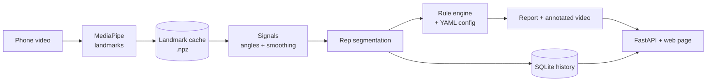

# Form Coach — Step-by-Step Project Guide

Reordered 2026-09-26, after Phases 0–2 were built. Changes from the original plan are
listed at the bottom under "What changed and why".

## Overview

A plan to build a web app that analyzes phone video of push-ups and gives per-rep form
feedback, with session history and progress tracking. Each phase ends with a "Done when"
test so you know whether you're finished.

The design principle throughout: the analysis pipeline knows nothing about the web, and
the web layer knows nothing about angles. Measurements are stored, verdicts are computed
from config.


```mermaid
flowchart LR
  A[Phone video] --> B[MediaPipe<br/>landmarks]
  B --> C[(Landmark cache<br/>.npz)]
  C --> D[Signals<br/>angles + smoothing]
  D --> E[Rep segmentation]
  E --> F[Rule engine<br/>+ YAML config]
  F --> G[Report + annotated video]
  G --> H[FastAPI + web page]
  E --> I[(SQLite history)]
  I --> H
```

The expensive step (MediaPipe) runs once per video; everything after the cache re-runs in
seconds. Measured on a 562-frame clip: 17 s to extract, 0.02 s from cache.

### Ordering principle

Two rules decide what comes first:

1. **Verify inputs before building on them.** Every phase checks the data it was handed
   before producing anything new. Most of the expensive mistakes in a pipeline are
   discovered three phases after they were made.
2. **Order work by what a mistake would cost.** A wrong sign in a signal invalidates two
   fault types and every number downstream. A bug in the drawing code produces a bad
   video. Do the first one early, where it is cheap to find.

### Tech stack

| Technology | Used for | Why this one |
| --- | --- | --- |
| Python 3.12 | Everything | MediaPipe and the scientific stack live here |
| Git + GitHub | Version control | Commit history is part of what recruiters see |
| Ruff | Lint + format | One tool, one command, consistent code |
| MediaPipe Tasks | Pose landmarks | Free, CPU-only, no training; `PoseLandmarker`, not `mp.solutions` |
| OpenCV | Video read/write, drawing | Industry standard for frames and overlays |
| NumPy | Geometry, arrays | Angle math and landmark storage |
| SciPy | Smoothing, peak finding | `savgol_filter` and `find_peaks` do most of Phase 3 |
| Dataclasses | Core data types | Typed, readable structures instead of loose dicts |
| PyYAML | Rule config | Readable, supports comments next to thresholds |
| pandas | Evaluation | Joins predictions to labels in a few lines |
| Matplotlib | Dev plots | For you while tuning, not for users |
| pytest | Tests | Standard, minimal boilerplate |
| GitHub Actions | CI | Runs Ruff + pytest on every push |
| FastAPI + Uvicorn | Web backend | Little code, type-driven validation, free `/docs` page |
| HTML + JS + Chart.js | Frontend | No framework learning curve; the project is about analysis |
| ffmpeg | Video re-encode | Browsers can't play OpenCV's default codec; H.264 fixes it |
| SQLite (`sqlite3`) | Session history | Single file, no server, write real SQL |
| Docker | Packaging | `docker run` works on any machine, ffmpeg and model included |

### Repo structure

```
form-coach/
  pipeline/
    models.py        # dataclasses
    landmarks.py     # MediaPipe extraction + cache
    signals.py       # angles, smoothing, in-position mask
    reps.py          # rep segmentation
    rules.py         # generic rule engine
    render.py        # annotated video
  configs/pushup.yaml
  data/videos/  data/labeling_sheet.md  data/labels.csv  data/cache/
  scripts/           # dev tools: label generation, data QA, signal plots
  eval/evaluate.py  eval/EXPERIMENTS.md
  app/main.py  app/db.py  app/static/
  tests/
  models/            # pose_landmarker_full.task, not tracked
  analyze.py         # CLI entry point
  Dockerfile
  .github/workflows/ci.yml
  pyproject.toml
  README.md
```

## Phase 0 — Setup

Create the repo, environment and empty skeleton so every later phase has a place to land.

1. Create the GitHub repo and clone it.
2. Create a virtual environment with Python 3.12: `py -3.12 -m venv .venv` on Windows,
   `python3.12 -m venv .venv` elsewhere. Check `python --version` inside the activated
   venv before installing anything — a venv built on the wrong interpreter fails later,
   confusingly, at `pip install mediapipe`.
3. Install: `pip install mediapipe opencv-python numpy scipy pyyaml pandas matplotlib
   pytest ruff fastapi uvicorn python-multipart`.
4. Freeze into `requirements.txt` (Docker uses it in Phase 8), and declare the direct
   dependencies in `pyproject.toml`. Two files, two jobs: `pyproject.toml` records what
   you chose, `requirements.txt` records what got installed.
5. Create the folder structure above, with empty files.
6. Add a `.gitignore` covering `.venv/`, `data/videos/`, `data/cache/`, `*.task`, `*.db`,
   `__pycache__/`, editor folders.
7. Configure Ruff in `pyproject.toml`: `line-length`, `target-version = "py312"`, and the
   lint rules `E, F, I, B, UP`. Exclude `docs`, or Ruff will reformat Python snippets
   inside your Markdown.
8. **Set up CI now, not later.** One workflow running `ruff check .` and `pytest` on every
   push. A one-line smoke test keeps `pytest` green until Phase 3 brings real tests —
   without it `pytest` exits 5 ("no tests collected") and CI is red from day one.
9. Write a three-line README: what the project will do, and that it's in progress.

**Done when:** the skeleton is pushed and the CI badge is green.

## Phase 1 — Film, label, and split the dataset

The dataset comes before any analysis code, because every later decision is tuned and
judged against it.

### Step 1: Write the labeling rules down first

Before filming, write the exact criterion for each fault. This is not paperwork — it is
the definition your evaluation measures against, and it has to mean the same thing at rep
140 as at rep 1.

| Column | Label 1 when… |
| --- | --- |
| shallow | At the bottom, the shoulder doesn't drop to elbow height (the upper arm never reaches parallel to the floor) |
| hip\_sag | The hips visibly drop below the shoulder–ankle line for a noticeable part of the rep, during the movement itself rather than while pausing at the top |
| hip\_pike | The hips visibly rise above the shoulder–ankle line (the body forms an inverted V) |
| no\_lockout | At the top, the arms stop visibly short of straight — a clear bend, not slight softness |

**Prefer criteria built from landmarks the model actually has.** "Shoulder drops to elbow
height" beats "chest above elbow height", because shoulder and elbow are both real points
in the 33 and the chest is not. When your label rule and your metric refer to the same
anatomy, a disagreement in Phase 5 means the detector was wrong — not that you were
comparing two different definitions.

Decide a borderline policy once, in advance, and record it. Then when a rep is ambiguous,
the question is "does this meet my written rule?", which is answerable, instead of "does
this feel shallow?", which is not.

### Step 2: Film

1. 20 clips of 8–10 reps each, **side view**, phone at floor-to-hip height, whole body in
   frame.
2. **Keep the hands and feet inside the frame.** If the floor is below the bottom edge,
   the wrists are outside it, and MediaPipe extrapolates them rather than observing them —
   silently, with no error. Every elbow-angle measurement on that clip is then built on a
   guess you cannot check by eye, because the true position isn't in the video.
3. Film each fault **on its own**: piking and sagging with full depth, shallow reps with a
   straight body. A fault that always co-occurs with another can't tell you which one your
   detector is responding to.
4. Also film one mixed, realistic set — the only clip resembling how someone actually
   trains.
5. **Vary conditions deliberately** between clips: room, time of day, camera distance and
   height, and which side faces the camera. Two clips of one fault filmed back to back in
   one spot teach the detector nothing about robustness.
6. Include one badly lit clip and one slightly off-angle clip.
7. Name them `clip01.mp4` … `clip20.mp4`.

Aim for at least 10–15 examples of each fault **across at least four clips**. The clip
count matters more than the rep count: reps within one clip share lighting, camera
position and body proportions, so they are not independent samples.

### Step 3: Label

One row per rep in a Markdown sheet (`data/labeling_sheet.md`), generated into
`data/labels.csv` by a small script:

```csv
clip,rep,shallow,hip_sag,hip_pike,no_lockout,notes
clip01,1,0,0,0,0,
clip02,3,1,0,0,0,
```

Keep the sheet as the source of truth and generate the CSV from it. You will relabel more
than once, and a hand-edited CSV drifts from the sheet without anything noticing. The
script is also where rep exclusions live, documented rather than silently applied.

A rep counts only when the person returns to the top position. Failed reps are not reps;
exclude them explicitly.

### Step 4: Choose the held-out clips — before writing any detection code

Set aside about 30% of clips, chosen so every fault appears at least once. Write the list
in the README. Do not evaluate on them until Phase 5 is otherwise finished.

This is what makes your final numbers mean "performance on unseen video" rather than
"performance after I tuned until it looked good". Choosing them now, before you have any
results to be tempted by, is the part that makes the claim credible.

**Done when:** every clip has a label row for every rep, `labels.csv` regenerates from the
sheet, and the held-out list is in the README.

## Phase 2 — Data types, landmarks, and input validation

Define the core types, get landmarks out of video, cache them, and **check them before
building anything on top**.

### Step 1: Core dataclasses (`pipeline/models.py`)

```python
from dataclasses import dataclass

@dataclass(frozen=True)
class VideoInfo:
    path: str
    fps: float
    width: int
    height: int
    n_frames: int

@dataclass(frozen=True)
class Rep:
    """All angles in degrees; `_s` marks seconds. Field names are the `metric:` values
    the YAML rules look up, so renaming one here means renaming it in the config."""
    index: int
    start_frame: int
    bottom_frame: int
    end_frame: int
    min_elbow_angle: float        # depth, elbow-based (diagnostic)
    min_upper_arm_angle: float    # depth, 0 = upper arm parallel to floor (shallow)
    max_elbow_angle: float        # lockout at the top (no_lockout)
    max_hip_drop: float           # hip below the body line (hip_sag)
    max_hip_rise: float           # hip above the body line (hip_pike)
    hip_sag_duration_s: float
    hip_pike_duration_s: float

@dataclass(frozen=True)
class Fault:
    rep_index: int
    rule: str
    message: str
    value: float
    frames: tuple[int, int]

@dataclass
class SessionResult:
    video: VideoInfo
    reps: list[Rep]
    faults: list[Fault]
```

`frozen=True` on the measurements: once a rep is measured, nothing downstream can quietly
change it. `SessionResult` is mutable because it is a container assembled in stages, not a
measurement.

Landmarks stay a NumPy array of shape `(n_frames, 33, 4)` holding x-pixels, y-pixels, z
and visibility, with `NaN` rows where no person was detected. Arrays, not dataclasses,
because you'll do vectorized math on them.

`models.py` imports only `dataclasses`. Every other pipeline module imports from it, so
keeping it dependency-free means it can never become a circular import.

**On `min_upper_arm_angle` vs `min_elbow_angle`:** the elbow angle needs three points —
shoulder, elbow, wrist — and the wrist is the landmark most likely to be outside the
frame. The upper-arm angle needs two, both of which you can see. Keep both fields: use the
upper-arm one for the `shallow` rule, and compare them in Phase 5 as a recorded
experiment.

### Step 2: Extraction (`pipeline/landmarks.py`)

1. Download `pose_landmarker_full.task` from the MediaPipe Pose Landmarker docs page into
   `models/`. It is a 9 MB binary; keep it out of git and document the download in the
   README, because it is the first thing a stranger cloning your repo will hit.
2. Write `extract_landmarks(path) -> tuple[VideoInfo, np.ndarray]` using `PoseLandmarker`
   in `RunningMode.VIDEO`.
3. Convert BGR → RGB before detection. Detection still runs on BGR, just worse, so a
   missing conversion looks like a bad model rather than a bug.
4. Pass strictly increasing millisecond timestamps. `int(i * 1000 / fps)` can repeat at
   high frame rates, and `VIDEO` mode raises when a timestamp does not advance.
5. Convert normalized x, y to pixels before storing. On 1920×1080 one x unit spans 1.78
   times as many pixels as one y unit, so angles computed from normalized coordinates are
   wrong.
6. Build the frame count from the frames you actually read, not from
   `CAP_PROP_FRAME_COUNT` — that value comes from container metadata and can disagree with
   reality.
7. Leave undetected frames as `NaN` rather than dropping them, so row *i* is always frame
   *i*.

### Step 3: Cache

`load_or_extract(path)`: if the cache exists, load it; otherwise extract and save.

Use `.npz`, not `.npy`. `.npy` holds one array, so it cannot store `fps`, `width` and
`height` — and a cache that needs the original video to be useful is only half a cache.
Your videos are private and not in the repo, and Phase 7 wants to recompute metrics for
old sessions without refilming.

### Step 4: Validate the landmarks

This step is new, and it is the highest-value hour in the phase.

1. **Draw one labelled frame.** Circles and names on the key landmarks, on a normal clip
   and a mirrored one. This proves the indices mean what you think and that x and y are
   stored in that order. Numbers can look entirely plausible with two indices swapped.
2. **Survey framing across all clips.** For each key joint, the percentage of frames where
   it falls outside the frame. This tells you which metrics are trustworthy on which
   clips, and it is the evidence behind a README limitation.
3. **Count frames with no detection at all.**

Do not skip to the plots. Every plot you draw from here on assumes the landmarks mean what
you think; this step is what establishes that.

**Done when:** `python -m pipeline.landmarks data/videos/clip03.mp4` writes a cache file
and reports frame count and undetected frames, and you have a framing table for all clips.

## Phase 3 — Signals, verification, and rep segmentation

Turn noisy per-frame landmarks into clean signals, verify them, then split them into `Rep`
objects.

### Step 1: Angles and smoothing (`pipeline/signals.py`)

1. `Side` and `pick_side(landmarks) -> Side`: a frozen dataclass holding one side's
   shoulder, elbow, wrist, hip and ankle indices, and the function that picks the side
   facing the camera by mean visibility. The far limb is occluded and MediaPipe only
   guesses it. Every series function below takes the chosen `Side`, so one side is used
   throughout and the choice is made in one place.
2. `angle(a, b, c)`: the angle at point b, via the dot product, with `np.clip` before
   `arccos`. Works on single points (returns a scalar) and on per-frame arrays (returns one
   angle per frame), so the same function serves the tests and the pipeline.
3. `elbow_angle_series(landmarks, side)`: shoulder–elbow–wrist angle per frame. Used for
   `no_lockout`. Needs the wrist.
4. `upper_arm_angle_series(landmarks, side)`: the angle of the shoulder→elbow vector above
   horizontal. 0 means the upper arm is parallel to the floor. Take the absolute value of
   both components so it works whichever way the person faces.
5. `torso_tilt_series(landmarks, side)`: the angle of the shoulder→ankle line from
   horizontal. Near 0° in a push-up, near 90° standing.
6. `hip_deviation_series(landmarks, side)`: how many degrees the hip sits off the straight
   shoulder–ankle line, **signed** — positive below the line (sagging), negative above
   (piking). The plain angle at the hip cannot tell sag from pike, since both make it
   smaller than 180°. Take the magnitude as 180° minus the hip angle, and the sign from
   whether the hip's y is greater than the line's y at the hip's x (image y points down).
   Do not use a 2D cross product for the sign: it depends on the direction of the line,
   so it flips on mirrored clips.
7. `in_position_window(tilt, max_tilt_deg) -> (start, stop)`: the longest run of frames
   where the body is roughly horizontal. See Step 3.
8. `interpolate_gaps(signal, max_gap)`: fill short gaps of missing frames by linear
   interpolation. Leave long gaps, and gaps at either end, as `NaN`.
9. `smooth(signal, fps, window_s)`: `scipy.signal.savgol_filter`, applied to each run of
   valid values separately so one `NaN` doesn't spread across a window. It removes jitter
   while keeping the shape of the dips better than a moving average. The window length is
   a Phase 5 tuning parameter.

Thresholds are required parameters, not defaults, so none are hardcoded in the module;
the caller passes them in from the config.

### Step 2: Verify the signals before segmenting

**The signed hip deviation is the highest-risk thing in the project.** Two of your four
faults depend on its sign convention, and nothing else you build will test it. Get it
backwards and `hip_sag` and `hip_pike` swap silently — the annotated video looks perfect,
the rep counts are right, and only the Phase 5 numbers look strange, by which point you
have built three phases on top of it.

Plot, in this order:

1. **Signed hip deviation on a sag clip and a pike clip.** Confirm sag is positive and pike
   negative. This is the acceptance test for the whole phase.
2. **The same on a mirrored clip.** Your sign logic must work whichever way the person
   faces.
3. **Upper-arm angle with rep bottoms marked.** Count matching is not enough — you want the
   markers on the actual bottoms. Eight peaks with two on the same rep and one rep missed
   gives the right count and the wrong segmentation.

Do not plot all 20 clips. Pick clips that answer a specific question.

### Step 3: Mask out setup and teardown

Every clip contains footage that is not reps: walking into frame, kneeling down, getting
up afterwards. Typically one to two seconds at each end. While standing, the upper-arm
angle sits in the middle of its rep range, so `find_peaks` can count the setup as a rep.

Use the torso tilt: keep only the longest continuous run where the body is roughly
horizontal, and segment inside that window.

### Step 4: Rep segmentation (`pipeline/reps.py`)

1. **Segment on the upper-arm angle**, not the elbow angle. Measured on 14 clips with one
   untuned parameter set, comparing detected rep counts to labelled ones: upper-arm angle
   9 correct, elbow angle 8, shoulder height 7. Shoulder height fails badly — 1 or 2 peaks
   where 8 were expected — because it is an absolute pixel position, so whole-body drift
   swamps the oscillation. The upper-arm angle is geometric and therefore invariant to the
   body moving around the frame. **Relative geometry beats absolute position.**
2. Invert the smoothed signal and run `scipy.signal.find_peaks`; each peak is a rep bottom.
   Because you segment on the depth signal, `bottom_frame` and `min_upper_arm_angle` fall
   out of the same computation and cannot disagree.
3. Use `prominence` to ignore small wobbles and `distance` to enforce a minimum time
   between reps. Both go in the YAML config, not in the code.
4. Define each rep's start and end as the high points between consecutive bottoms.
5. Compute each rep's metrics and return `list[Rep]`.
6. **Return `NaN` for a metric whose landmarks were outside the frame**, rather than a
   confidently wrong number. "I could not measure this" is information; a plausible wrong
   value is not.

Note that segmentation tolerates bias where thresholds do not. A signal that is
consistently off by 15° still peaks in the right places, so reps are found correctly, while
a threshold at 100° would be badly wrong. This is why a signal can be good enough to
segment on and not good enough to measure with.

### Step 5: Check rep counts against your labels

Do not wait for Phase 5. As soon as `reps.py` runs, compare detected rep counts per clip to
the number of reps you labelled. Segmentation sits upstream of everything: a wrong count
does not cost you one metric, it costs you the whole clip, because every per-rep
measurement is then computed over the wrong frames and your join to `labels.csv` is
misaligned.

When the counts disagree, **check the label as well as the code**. A disagreement is
evidence about one of them, and it is not always the code. If you only ever tune
parameters until the numbers rise, you will never find a mislabelled clip.

### Step 6: Tests (`tests/`)

Test with synthetic signals, where you know the right answer exactly:

```python
def test_counts_eight_reps():
    t = np.linspace(0, 16, 480)                 # 16 s at 30 fps
    signal = 125 + 45 * np.cos(2 * np.pi * t / 2)
    signal += np.random.default_rng(0).normal(0, 3, t.size)
    assert len(find_rep_bottoms(signal, fps=30)) == 8
```

Also test `angle` on known triangles (a right angle must return 90), and
**`hip_deviation_series` on synthetic points above and below a known line, asserting the
sign**. That is the cheapest possible guard on the riskiest piece of arithmetic.

A fixed random seed keeps the test deterministic. Tests must not depend on your video
files, which aren't in git.

**Done when:** the sign convention is verified by plot and by test, rep counts match your
labels on most clips, and CI is green.

## Phase 4 — Rule engine and feedback

Build a generic engine that applies rules read from YAML to each `Rep`, producing `Fault`
objects and a report.

### Step 1: The config (`configs/pushup.yaml`)

```yaml
exercise: pushup
rules:
  shallow:
    metric: min_upper_arm_angle
    max: 5            # never came within 5 deg of parallel to the floor
    message: "Not reaching full depth"
  hip_sag:
    metric: max_hip_drop
    max: 15           # hip more than 15 deg below the body line
    duration_metric: hip_sag_duration_s
    min_duration_s: 0.3
    message: "Hips dropping — engage your core"
  hip_pike:
    metric: max_hip_rise
    max: 15           # hip more than 15 deg above the body line
    duration_metric: hip_pike_duration_s
    min_duration_s: 0.3
    message: "Hips too high — lower them into a straight line"
  no_lockout:
    metric: max_elbow_angle
    min: 160          # arms should be nearly straight at the top
    message: "Straighten your arms fully at the top"

segmentation:
  smoothing_window_s: 0.4
  min_prominence_fraction: 0.3
  min_rep_spacing_s: 0.8
  max_torso_tilt_deg: 35
```

Rule names match the column names in `labels.csv`, so Phase 5 compares predictions to
labels without a mapping table.

`duration_metric` names the field explicitly rather than relying on a convention like
`<rule>_duration_s`. Without it the engine has to know that `hip_sag` pairs with
`hip_sag_duration_s`, which is push-up knowledge inside code that is supposed to be
exercise-agnostic.

Comment every threshold with why it has that value. The starting values are guesses; Phase
5 replaces them with measured choices.

### Step 2: The engine (`pipeline/rules.py`)

1. Load the YAML into a small `Rule` dataclass (name, metric, min, max, duration_metric,
   min_duration_s, message).
2. Write `evaluate(reps, rules) -> list[Fault]`: for each rep and rule, read the metric off
   the `Rep` and compare against the bounds.
3. **Handle three outcomes, not two: fault, no fault, and could not evaluate.** If a metric
   is `NaN` because a landmark was outside the frame, `NaN > 15` is `False` in Python, so
   no fault fires and the rep is silently recorded as clean. In Phase 5 that becomes a
   *miss* charged to your detector, when the truth is you had no data. Count those
   separately and report them.
4. Keep the engine exercise-agnostic: it should never mention push-ups, only metrics and
   bounds. That's what lets a free throw be a new YAML file later.

### Step 3: Output and the annotated video

1. Write `analyze.py`, the CLI entry point: load or extract → signals → reps → rules →
   `SessionResult`.
2. Print a per-rep report and save it as JSON (`dataclasses.asdict` does the conversion).
3. Now write `pipeline/render.py`: draw the skeleton with `cv2.line` and `cv2.circle`, turn
   it red during faulty reps, and write the rep number on screen.

Rendering is here rather than in Phase 2 because the version worth writing is the one that
shows faults. Written earlier, you build a plain skeleton viewer and then rewrite it.

### Step 4: Feedback priority (adopted for `hip_pike` over `shallow`)

Coaches correct one thing at a time, body position first. On a rep with piked hips, "hips
too high" is the useful cue; "not deep enough" on top of it is noise. It is also the cue the
detector is worst at: with the hips piked, the upper arm is seen end-on and depth reads as
shallow when it isn't (see the README limitations). A piked rep at full depth is essentially
a pike push-up, a harder variation, and was hard to perform even on purpose while filming,
so hiding depth on piked reps loses little.

How it is built:

1. Declare it in the YAML, on the rule that gets hidden, so reading one rule shows every
   condition under which it is reported:
   ```yaml
   shallow:
     metric: min_upper_arm_angle
     max: 5
     suppressed_by: [hip_pike]   # hips first; depth reads wrong on piked reps anyway
   ```
2. **The engine still evaluates every rule.** Suppression is applied when building the
   feedback, not inside `evaluate()`: the fault is kept and marked suppressed. Measurement and
   presentation stay separate, and Phase 5 can score the raw detector.
3. A rule whose own result is "could not evaluate" suppresses nothing: an unmeasured pike is
   not evidence of a pike.
4. **Phase 5 reports both** `shallow` numbers: the raw detector, and the feedback after
   suppression. Reporting only the second would hide a weak detector behind a product rule.

Decide separately whether `hip_sag` suppresses `shallow` too. Depth on sagging reps is
measured well, so that would drop correct information purely as a product choice: a
legitimate one, but a different argument from the pike case.

**Done when:** `python analyze.py data/videos/clip03.mp4` produces an annotated video plus
a JSON report listing each rep's faults.

## Phase 5 — Evaluation

Measure how well the detector matches your labels, then tune thresholds against those
numbers instead of by eye. This phase is what separates the project from typical
pose-estimation demos.

1. Write `eval/evaluate.py`: run the pipeline over every cached clip and collect predicted
   faults per rep.
2. Load `labels.csv` with pandas and join on `(clip, rep)`. The join only works if rep
   numbering matches, which is why Phase 3 Step 5 exists.
3. Per fault type, count detected, missed, false alarms and **could-not-evaluate**, then
   compute precision and recall.
4. **Tune on the training clips only.** The held-out clips from Phase 1 stay untouched
   until you are finished tuning.
5. Change one thing at a time and re-run. Log each experiment in `eval/EXPERIMENTS.md`:
   what you changed, the resulting numbers, what you concluded. Include the experiments you
   ran earlier — the segmentation signal comparison belongs here.
6. Watch for over-fitting: if a threshold only works for one clip, it's not a good
   threshold.
7. **Then** run once on the held-out clips, and report that table.

| Fault | Detected | Missed | False alarms | Precision | Recall |
| --- | --- | --- | --- | --- | --- |
| shallow | 31 | 2 | 1 | 0.97 | 0.94 |
| hip\_sag | 14 | 9 | 6 | 0.70 | 0.61 |

(Example numbers, to show the shape.)

When reporting, state the clip count alongside the rep count. Reps within a clip are not
independent samples, so precision computed over 158 reps from 20 clips carries less
confidence than the rep count suggests.

**Done when:** you have a held-out table you trust and can explain in two sentences why
your weakest fault type is the weakest.

## Phase 6 — Web app

Wrap the existing pipeline in a FastAPI service and a single web page. No analysis logic
lives in the web layer.

### Step 1: Backend (`app/main.py`)

1. `POST /analyze`: accept an uploaded video (`UploadFile`), save it, call the same
   function `analyze.py` uses, return the result as JSON.
2. `GET /videos/{id}`: serve the annotated video.
3. Serve `app/static/` for the frontend.
4. Run with `uvicorn app.main:app --reload --host 0.0.0.0` so your phone on the same Wi-Fi
   can reach it.

### Step 2: Browser-playable video

OpenCV usually writes a codec browsers won't play. After rendering, re-encode with ffmpeg:

```bash
ffmpeg -y -i annotated_raw.mp4 -c:v libx264 -pix_fmt yuv420p annotated.mp4
```

Call it from Python with `subprocess.run(..., check=True)`.

### Step 3: Frontend (`app/static/index.html`)

One page, plain HTML and JavaScript: a file input (with `accept="video/*"`, which lets
phones record directly), an upload button, a spinner, then the annotated video, a rep table
and a Chart.js chart of the depth signal over time. Make it readable at phone width.

### Step 4: Error handling at the boundaries

| Input | Response |
| --- | --- |
| Not a video file | 400, "Please upload a video file" |
| Video longer than ~2 minutes | 413, "Videos must be under 2 minutes" |
| No person detected in most frames | 422, "Couldn't find a person — check framing" |
| Person found but key landmarks outside the frame | 422, "Keep your hands and feet in shot" |
| Person found but zero reps | 200 with an empty rep list and a hint about camera angle |

The fourth row comes out of Phase 2's framing survey: "detected but badly framed" is a
different failure from "not detected", and it is the one your own clips actually hit.

Raise these as custom exceptions in the pipeline and translate them to HTTP responses in
one place in the API.

### Step 5: API tests

Use FastAPI's `TestClient` to test two or three endpoints without starting a server: a
non-video upload returns 400, a short fixture video returns reps. Keep one tiny test video
(a few seconds, low resolution) in `tests/fixtures/` so CI can run it.

**Done when:** you film on your phone, upload from the phone's browser, and see the
annotated video and report.

## Phase 7 — Session history and progress

Store every analyzed session in SQLite and show progress over time. The key rule: store
measurements, compute verdicts at read time from the current config, so history stays
consistent when thresholds change.

### Step 1: Schema (`app/db.py`)

```sql
CREATE TABLE sessions (
    id             INTEGER PRIMARY KEY,
    created_at     TEXT NOT NULL,
    exercise       TEXT NOT NULL,
    video_path     TEXT,
    landmarks_path TEXT
);

CREATE TABLE reps (
    id                   INTEGER PRIMARY KEY,
    session_id           INTEGER NOT NULL REFERENCES sessions(id),
    rep_index            INTEGER NOT NULL,
    start_s              REAL,
    end_s                REAL,
    min_elbow_angle      REAL,
    min_upper_arm_angle  REAL,
    max_elbow_angle      REAL,
    max_hip_drop         REAL,
    max_hip_rise         REAL,
    hip_sag_duration_s   REAL,
    hip_pike_duration_s  REAL
);
```

The `reps` columns mirror the `Rep` dataclass, so saving one is a direct mapping. Note that
`Rep` works in frames while the table stores seconds — decide where that conversion lives
and be able to say why. Keeping `landmarks_path` means you can compute new metrics for old
sessions later without refilming.

### Step 2: Read and write functions

1. `save_session(result: SessionResult) -> int`: insert the session and its reps in one
   transaction; return the id.
2. `list_sessions()`, `get_session(id)`, `get_progress(metric)`: return dataclasses, not
   raw rows.
3. Use parameterized queries (`?` placeholders), never string formatting.

### Step 3: Progress metrics

Pick four: reps per session, percentage of clean reps, average depth, and a fatigue index
(average depth in the last third of the set minus the first third). Compute clean/faulty
with the current YAML thresholds, not stored flags.

### Step 4: Endpoints and page

1. `GET /sessions`, `GET /sessions/{id}`, `GET /progress?metric=avg_depth`.
2. A history page: a list of past sessions and a Chart.js line chart with a dropdown.
3. Show a rolling average and a shaded band for spread across reps. With few sessions,
   single points are mostly noise; don't label a change as "improvement" off tiny samples.

**Done when:** analyzed sessions persist across restarts and the history page shows a
progress chart with a metric dropdown.

## Phase 8 — Docker, README and polish

Package the app so anyone can run it with one command, then make the repo presentable.
This is the part recruiters actually see.

### Step 1: Dockerfile

```dockerfile
FROM python:3.12-slim
RUN apt-get update && apt-get install -y --no-install-recommends \
        ffmpeg libgl1 libglib2.0-0 \
    && rm -rf /var/lib/apt/lists/*
WORKDIR /app
COPY requirements.txt .
RUN pip install --no-cache-dir -r requirements.txt
COPY . .
ADD https://storage.googleapis.com/mediapipe-models/pose_landmarker/pose_landmarker_full/float16/1/pose_landmarker_full.task models/
EXPOSE 8000
CMD ["uvicorn", "app.main:app", "--host", "0.0.0.0", "--port", "8000"]
```

The `slim` base keeps the image small; `ffmpeg` is needed for re-encoding; `libgl1` and
`libglib2.0-0` are system libraries OpenCV needs that slim images lack; copying
`requirements.txt` before the code lets Docker cache the install layer.

### Step 2: Build and run

1. Add a `.dockerignore` with `.venv/`, `data/videos/`, `data/cache/`, `.git/`.
2. Build: `docker build -t form-coach .`
3. Run with a volume so the database and uploads survive restarts:
   `docker run -p 8000:8000 -v "$(pwd)/data:/app/data" form-coach`
4. Test from a clean state: delete the cache and database, run the container, upload a
   video.

### Step 3: README

1. One-sentence description and a 60-second demo video or GIF at the top.
2. Quick start: `docker run …` in one line, plus the non-Docker setup including the model
   download.
3. Architecture: the flow diagram and one line per module.
4. Dataset: clip and rep counts, the labeling rules, the held-out split.
5. Evaluation: the held-out precision/recall table.
6. What was hard and what you tried, from `EXPERIMENTS.md`.
7. Limitations. State what your method structurally cannot measure and why — a lower-back
   arch has no spine landmarks; elbow metrics need the hands in frame. A README that names
   its own weak points reads as confidence, not weakness.

### Step 4: Final pass

- [ ] Type hints on all public functions
- [ ] No magic numbers outside the YAML config
- [ ] All tests pass, CI badge green
- [ ] Ruff clean
- [ ] Someone else runs it from the README alone

**Done when:** a stranger can go from the README to a working analysis in under five
minutes.

## Buffer, stretch goals and talking points

Something will take twice as long as planned, most likely Phase 3 or Phase 6. If you fall
behind, cut in this order: Docker, then Phase 7 down to a plain session list. Never cut
evaluation.

### Stretch goals, in order

1. **LLM phrasing layer:** send the numeric report (never the video) to an LLM to turn it
   into coaching text. Measurement stays deterministic; the model only handles language.
2. **Free throw:** a new YAML config and metrics. The payoff for keeping the rule engine
   generic.

### Deliberately skipped

Auth, cloud deployment, microservices, a frontend framework. Thinly done, they invite
questions you can't answer deeply.

### Design decisions to be ready to explain

| Decision | Rejected alternative | Why |
| --- | --- | --- |
| Analysis separate from web layer | Logic inside endpoints | Pipeline works from CLI, web, or a future phone app unchanged |
| Rules as YAML config | Hardcoded thresholds | Tuning and new exercises without touching logic |
| Landmark cache in `.npz` | Re-running MediaPipe, or `.npy` | Iteration in seconds, and the cache doesn't need the video |
| Upper-arm angle for depth | Elbow angle | Matches the labeling rule, and needs no wrist landmark |
| Segment on upper-arm angle | Elbow angle, or shoulder height | Measured on 14 clips; geometry beats absolute position |
| Frozen dataclasses | Passing dicts | Typed, immutable measurements; clear contracts between modules |
| Store measurements, not verdicts | Saving fault flags | History stays consistent when thresholds change |
| Held-out clips chosen before coding | Tuning and reporting on all clips | Final numbers describe unseen video |
| `NaN` for unmeasurable metrics | A plausible default | "Couldn't measure" is information; a wrong number isn't |
| Synthetic-signal tests | Tests on real videos | Deterministic, fast, and run in CI without private data |

### One-line description for your CV

Web app that analyzes phone video of push-ups and gives per-rep form feedback. Modular
pipeline (pose estimation → signal processing → config-driven rule engine) behind a FastAPI
service with SQLite session history, evaluated against hand-labeled reps with a held-out
test set. Python, MediaPipe, SciPy, FastAPI, SQLite, pytest, Docker, GitHub Actions.

## What changed and why

Against the original plan, after building Phases 0–2:

| Change | Reason |
| --- | --- |
| CI moved from Phase 3 to Phase 0 | Lint on every push from day one; a smoke test keeps `pytest` green |
| Labeling rules written before filming (Phase 1 Step 1) | They define the evaluation, so they can't be retrofitted |
| Held-out split chosen in Phase 1 | Must be decided before any results exist to be tempted by |
| Landmark validation added (Phase 2 Step 4) | Framing survey caught wrists outside the frame in 3 clips, ~90% of frames |
| Angle functions stay in Phase 3, plots moved there too | The original asked for plots in Phase 2, before the functions existed |
| `render.py` moved from Phase 2 to Phase 4 | The version worth writing shows faults, which need Phases 3 and 4 |
| Signal verification promoted to its own step (Phase 3 Step 2) | The hip-deviation sign is the highest-risk arithmetic in the project |
| Setup/teardown mask added (Phase 3 Step 3) | Every clip has 1–2 s of non-rep footage that `find_peaks` can count |
| Segmentation switched to upper-arm angle | Measured: 9 of 14 clips correct vs 8 for elbow, 7 for shoulder height |
| Rep-count check moved into Phase 3 (Step 5) | Segmentation is upstream of everything; don't wait for Phase 5 to find it broken |
| `duration_metric` added to the YAML schema | Otherwise the "generic" engine has to hardcode which duration pairs with which rule |
| Third rule outcome: could-not-evaluate | `NaN > 15` is `False`, so unmeasurable silently reads as "clean" |
| `Rep` fields renamed and extended | Added `min_upper_arm_angle`, `hip_pike_duration_s`; dropped the `_deg` suffix |
| Cache format `.npy` → `.npz` | Stores video metadata with the landmarks, so the cache stands alone |
