# The math behind `signals.py`

`pipeline/signals.py` turns MediaPipe's landmarks into signals: one number per video
frame, such as how bent the elbow is or how far the hips sit off a straight line. Later
stages cut those signals into reps and compare them against thresholds. This page explains
every calculation in the module, with a picture for each.

Every figure is drawn by [`scripts/make_signals_figures.py`](../scripts/make_signals_figures.py),
which calls the real functions in `signals.py` on made-up points. The numbers in the pictures
are therefore the numbers the code produces.

**Contents**

0. [Image coordinates](#0-image-coordinates)
1. [Picking a side](#1-picking-a-side--pick_side)
2. [The angle at a joint](#2-the-angle-at-a-joint--angle)
3. [The upper-arm angle](#3-the-upper-arm-angle--upper_arm_angle_series)
4. [Why there are two arm angles](#4-why-there-are-two-arm-angles)
5. [Torso tilt](#5-torso-tilt--torso_tilt_series)
6. [Hip deviation](#6-hip-deviation--hip_deviation_series)
7. [Finding runs](#7-finding-runs--runs)
8. [The in-position window](#8-the-in-position-window--in_position_window)
9. [Filling gaps](#9-filling-gaps--interpolate_gaps)
10. [Smoothing](#10-smoothing--smooth)
11. [Summary](#11-summary)

---

## 0. Image coordinates

Every landmark is an `(x, y)` position in pixels, and in images **y grows downward**. The
origin is the top-left corner of the frame.

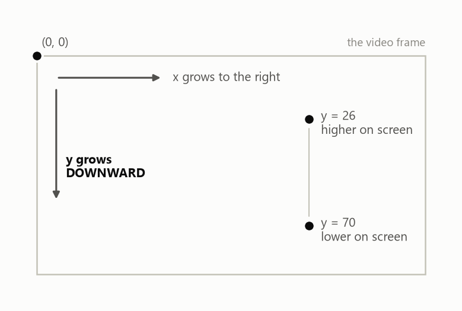

This one convention decides several signs later on. "The hip is *below* the line" means the
hip has the **larger** y. Keep it in mind whenever a comparison looks backwards.

All angles in this module are in **degrees**.

---

## 1. Picking a side — `pick_side`

The camera films from the side, so one arm and one leg face the camera and the others are
hidden behind the body. MediaPipe still reports a position for the hidden limbs, but it
guesses them, and it says so through each landmark's **visibility** score, a number between
0 and 1.

`pick_side` averages visibility over the five landmarks it uses (shoulder, elbow, wrist, hip
and ankle) on each side, across the whole clip, and keeps the side with the higher average:

```
left  = mean visibility of left  shoulder, elbow, wrist, hip, ankle
right = mean visibility of right shoulder, elbow, wrist, hip, ankle
side  = LEFT if left >= right else RIGHT
```

Every other function then takes this `Side`, so one side is used for the whole clip and the
choice is made in exactly one place.

---

## 2. The angle at a joint — `angle`

The angle at a joint `b` is the angle between the two lines leaving it: towards `a` and
towards `c`. For the elbow, `a` is the shoulder and `c` is the wrist.

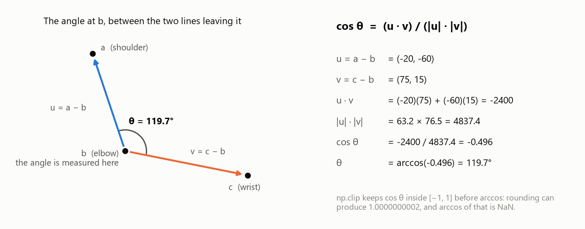

Make two vectors that start at `b`, then use the dot product:

$$
\mathbf{u} = a - b, \qquad \mathbf{v} = c - b, \qquad
\cos\theta = \frac{\mathbf{u}\cdot\mathbf{v}}{|\mathbf{u}|\,|\mathbf{v}|}
$$

The dot product `u · v` multiplies matching components and adds them. Dividing by the two
lengths turns it into the cosine of the angle between them, and `arccos` gives the angle
back.

Some reference values:

| angle | meaning |
| --- | --- |
| 180° | the three points are in a straight line (a straight arm) |
| 90° | a right angle |
| near 0° | the joint is folded shut |

Two implementation details:

- **`np.clip(cos, -1, 1)`.** Mathematically the cosine is always between −1 and 1, but
  floating-point rounding can produce `1.0000000002`, and `arccos` of that is `NaN`.
  Clipping costs nothing and removes the failure.
- **Arrays of points.** The code sums over the *last* axis (`axis=-1`), which always holds
  the x/y pair. So the same function takes three single points and returns one number, or
  three arrays of points (one per frame) and returns one angle per frame.

---

## 3. The upper-arm angle — `upper_arm_angle_series`

This measures which way the upper arm (shoulder → elbow) points, relative to the floor:

$$
\text{upper-arm angle} = \operatorname{atan2}\big(|dy|,\ |dx|\big),
\qquad (dx,\ dy) = \text{elbow} - \text{shoulder}
$$

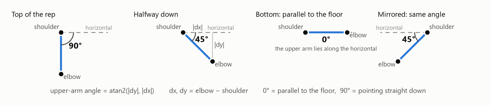

- **90°**: the upper arm points straight down, at the top of a push-up.
- **0°**: the upper arm is parallel to the floor, at the bottom of a deep push-up.

This single signal does two jobs. It is the **depth** measurement for the `shallow` fault,
whose rule is "the upper arm never reaches parallel to the floor". It is also the signal
the pipeline uses to find reps.

Two details make it robust:

- **`atan2(y, x)` instead of `atan(y / x)`.** When the arm is exactly vertical, `dx` is 0 and
  `y / x` divides by zero. `atan2` takes the two components separately and handles that.
- **The absolute values.** A person facing left has the elbow left of the shoulder, so `dx`
  is negative. Taking `|dx|` and `|dy|` folds every direction into 0°–90°, so a mirrored clip
  gives the same angle (the fourth panel).

It is also unaffected by where the body is in the frame, or how far it is from the camera,
because it depends only on the *direction* between two points, not their position.

---

## 4. Why there are two arm angles

`elbow_angle_series` is `angle(shoulder, elbow, wrist)`: how bent the elbow joint is. It
sounds similar to the upper-arm angle, but it measures something different.

- The **upper-arm angle** compares one bone to the floor. It says where the arm points.
- The **elbow angle** compares two bones to each other. It says whether the arm is straight.

Neither one determines the other:

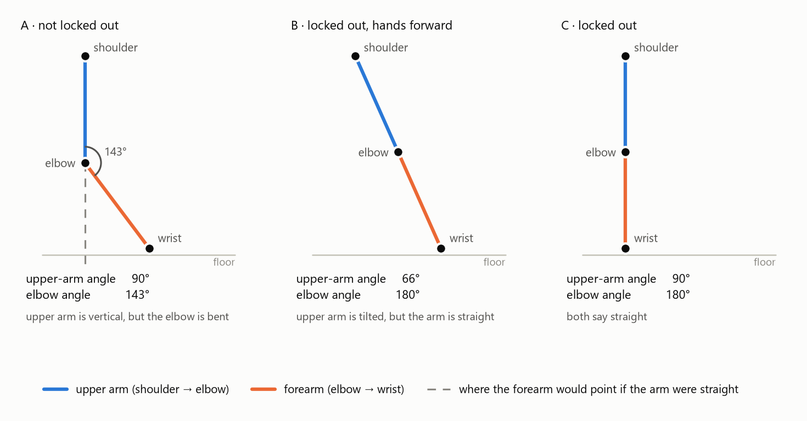

- **A**: the upper arm is perfectly vertical (90°), but the elbow is bent to 143°. Judged
  by the upper arm alone, it would pass as locked out.
- **B**: the arm is dead straight (180°), but the hands are placed forward, so the upper arm
  reads only 66°. Judged by the upper arm alone, it would fail.

So each fault uses the angle that matches its labelling rule:

| fault | the rule is about | measured with |
| --- | --- | --- |
| `shallow` | where the upper arm points at the bottom | upper-arm angle |
| `no_lockout` | whether the arm is straight at the top | elbow angle |

The elbow angle needs the wrist, the landmark most likely to fall outside the frame when the
floor is cut off. That is one more reason depth uses the upper-arm angle, which only needs
the shoulder and elbow.

---

## 5. Torso tilt — `torso_tilt_series`

The same formula as the upper-arm angle, applied to shoulder → **ankle** instead:

$$
\text{torso tilt} = \operatorname{atan2}\big(|dy|,\ |dx|\big),
\qquad (dx,\ dy) = \text{ankle} - \text{shoulder}
$$

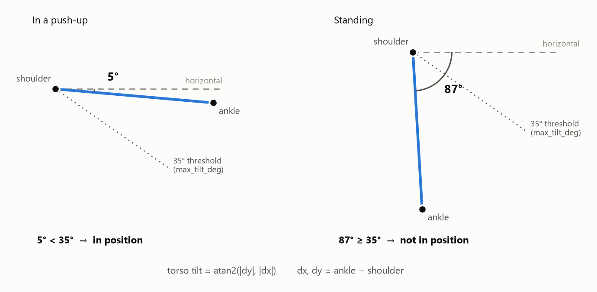

In a push-up the body is close to horizontal (a few degrees). Standing, it is close to 90°.
Comparing against a threshold (`max_tilt_deg`, 35° here) separates frames where the person
is in a push-up from frames where they are walking in, kneeling or getting up. Section 8
uses this.

---

## 6. Hip deviation — `hip_deviation_series`

This decides two of the four faults: `hip_sag` (the hips drop) and `hip_pike` (the hips rise).
It answers: **how far is the hip off the straight shoulder–ankle line, and on which side?**
That takes two calculations, one for the amount and one for the direction.

### 6.1 How far: the magnitude

$$
\text{magnitude} = 180^\circ - \angle(\text{shoulder},\ \text{hip},\ \text{ankle})
$$

Stand at the hip and look at the shoulder, then at the ankle. If the body is straight, the
hip lies on the line and those two directions are exactly opposite: 180°. Any bend makes the
angle smaller, so `180° − angle` is the number of degrees away from straight.

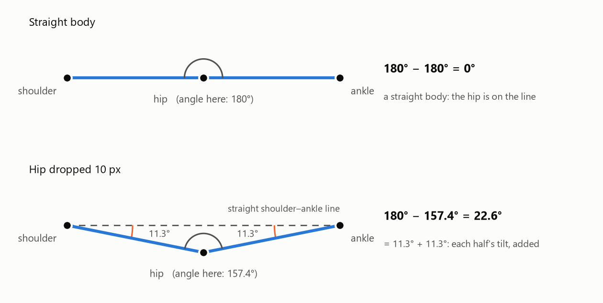

Worked through for shoulder `(0, 0)`, hip `(50, 10)`, ankle `(100, 0)`, where the hip has
dropped 10 px:

| step | value |
| --- | --- |
| u = shoulder − hip | (−50, −10) |
| v = ankle − hip | (50, −10) |
| u · v | (−50)(50) + (−10)(−10) = −2400 |
| \|u\| · \|v\| | 2600 |
| cos θ | −2400 / 2600 = −0.923 |
| angle at the hip | 157.4° |
| **magnitude** | 180° − 157.4° = **22.6°** |

A useful way to read the result: each half of the body tilts away from the straight line,
here by `atan(10 / 50) = 11.3°` each, and **the deviation is the two tilts added together**:
11.3° + 11.3° = 22.6°.

It is an angle rather than a distance in pixels on purpose. A 10 px drop means very
different things at 1 m and at 3 m from the camera, but the angle does not change with
distance.

### 6.2 Which way: the sign

The magnitude cannot tell a sag from a pike. A hip 10 px *below* the line and one 10 px
*above* it bend the body by the same 22.6°. The direction has to come from somewhere else.

The code finds the height of the shoulder–ankle line at the hip's x position, and compares
the hip against it:

$$
t = \frac{x_\text{hip} - x_\text{shoulder}}{x_\text{ankle} - x_\text{shoulder}},
\qquad
y_\text{line} = y_\text{shoulder} + t\,(y_\text{ankle} - y_\text{shoulder})
$$

`t` is how far along the line the hip sits, as a fraction: 0 at the shoulder, 1 at the ankle,
0.5 halfway. `y_line` is then the line's height at that point, found by moving `t` of the way
from the shoulder's height to the ankle's. This is ordinary linear interpolation.

Then:

- `y_hip > y_line`: the hip is lower on screen than the line, so it is **below** it →
  **positive → sag**
- otherwise: the hip is **above** the line → **negative → pike**

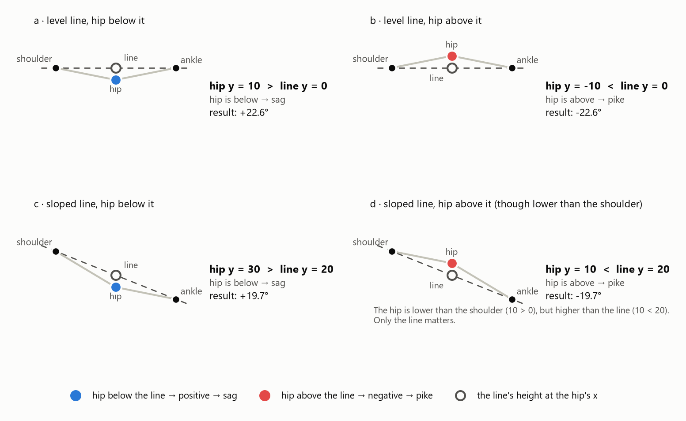

Panel **d** is the case that shows why the comparison is against the *line* and not against
the shoulder. When the camera isn't level, the body line slopes. There, the hip (y = 10) is
lower than the shoulder (y = 0), yet higher than the line (y = 20 at that x), so it is a
**pike**. A simpler check such as "is the hip lower than the shoulder?" would call it a sag
and be wrong.

### 6.3 Mirrored clips

Some clips are filmed from the other side, so the shoulder and ankle swap ends.

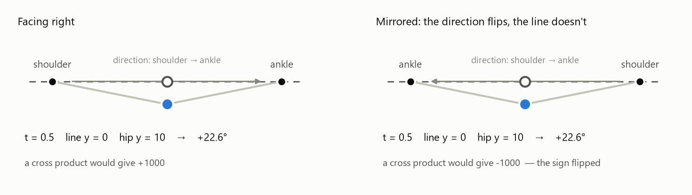

The result is identical, and the reason is simple: the formula asks for **the height of the
line at the hip's x**, and that is the same line at the same x whichever end you call the
shoulder. Swapping the ends changes `t` into `1 − t`, which lands on exactly the same point.

The obvious alternative is a 2D cross product, which also tells you which side of a line a
point is on. But its sign depends on the **direction** you walk along the line, shoulder to
ankle. Mirroring reverses that direction, so the cross product gives +1000 on one clip and
−1000 on the other for the same physical sag. That would silently swap `hip_sag` and
`hip_pike` on every mirrored clip. `tests/test_signals.py` has a test that swaps the shoulder
and ankle and checks the sign is unchanged, so the difference is guarded.

### 6.4 The one guard

If the shoulder and ankle have the same x, the line is vertical. `t` then divides by zero,
and "the height of the line at the hip's x" has no meaning. Those frames return `NaN`. In
practice the in-position window (section 8) removes standing frames first, so this only
prevents a crash; it doesn't make the result meaningful.

---

## 7. Finding runs — `runs`

Three functions need the same step: given a True/False value for each frame, find each
continuous stretch of `True`. The function `runs` does it with one NumPy trick:

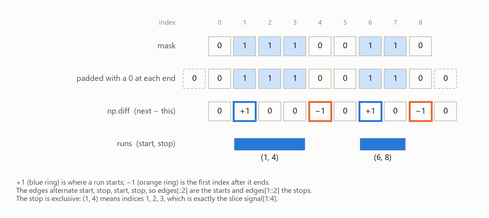

1. **Pad** the mask with a `0` at each end.
2. **`np.diff`** subtracts each value from the next. It is `+1` where a run starts, `−1` where
   one ends, and `0` elsewhere.
3. **`np.flatnonzero`** lists those positions: `[1, 4, 6, 8]`. They always alternate start,
   stop, start, stop, so `[::2]` gives the starts and `[1::2]` the stops.

Without the padding, a run touching either end of the array would have no `+1` or no `−1` to
find.

Each run comes back as `(start, stop)` with the stop **exclusive**, the same convention as
Python slices: `(1, 4)` means frames 1, 2 and 3, which is exactly `signal[1:4]`.

---

## 8. The in-position window — `in_position_window`

Every clip starts and ends with footage that isn't push-ups: walking in, kneeling down,
getting up. While standing, the upper-arm angle sits in the middle of its range, so the rep
finder could count the setup as a rep. This function finds the part of the clip that is
actually push-ups.

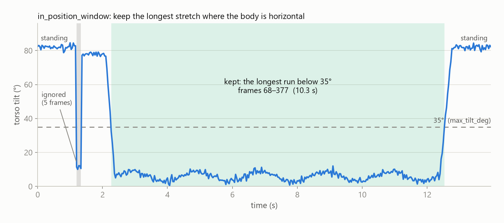

1. Mark each frame where the torso tilt (section 5) is below `max_tilt_deg`.
2. Find the runs (section 7).
3. Keep the **longest** one.

Taking the longest run, not every horizontal frame, is what makes it robust. A brief
horizontal moment while setting up (the gray band) is a run too, but a short one, so it is
ignored. Frames with unknown tilt count as standing, so missing data is left out rather
than let in.

---

## 9. Filling gaps — `interpolate_gaps`

MediaPipe occasionally loses the person for a frame or two. Those frames are `NaN`.

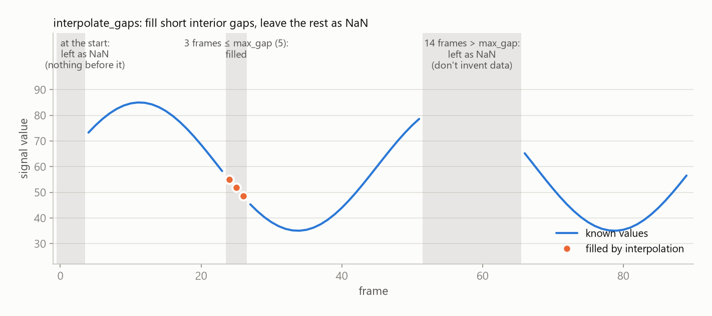

For each gap (a run of `NaN`, found with section 7), draw a straight line between the known
values on either side and read the missing values off it (`np.interp`). But only when:

- the gap is **short**, no longer than `max_gap` frames. A few missing frames is a detection
  hiccup, and a straight line across it is a fair guess. A long gap means the person left the
  frame, and filling it in would be inventing data.
- the gap is **inside** the signal. A gap at the very start or end has a known value on only
  one side, so there is nothing to draw a line between.

---

## 10. Smoothing — `smooth`

Landmark positions jitter slightly from frame to frame. On the recorded clips the upper-arm
angle wobbles by about 0.3–0.9° per frame. That is small, and whether it matters depends on
what the signal is used for. Measured on the clips, comparing each calculation with and
without smoothing:

| used for | raw vs smoothed | does smoothing matter? |
| --- | --- | --- |
| counting reps | 11 of 11 clips counted correctly either way | no |
| lockout (highest elbow angle) | differ by under 1° | no |
| depth (lowest upper-arm angle) | differ by up to 3° | somewhat: a `shallow` threshold is only a few degrees |
| how long the hips sag | raw splits one sag into several pieces | **yes** |

**Counting reps doesn't need it.** The rep finder only accepts a dip that stands out from its
surroundings by a large margin, and a 1° wobble never does. **The top of a rep** is a flat
plateau, so a little noise barely moves the highest value either.

**Durations are where it matters.** The `hip_sag` rule asks how long the hip deviation stays
above a threshold. When the signal hovers near the threshold, even small wobbles push it back
and forth across the line, so one continuous sag turns into several short pieces:

| clip | sagging reps | stretches above 15°, raw | stretches above 15°, smoothed |
| --- | --- | --- | --- |
| clip19 | 9 | 13, of which 4 last under 0.3 s | 9, none under 0.3 s |
| clip04 | 8 | 11 | 8 |

Smoothed, there is exactly one stretch per sagging rep. Raw, some sags break into pieces
shorter than 0.3 s, and the rule requires a sag to last at least 0.3 s, so those pieces are
discarded and a real sag can be missed. A threshold test has no margin the way peak finding
does, so it is the thing small noise breaks.

The remaining question is *how* to smooth.

**A moving average** replaces each value with the average of the values around it. That
works well on flat stretches, but at the bottom of a dip it averages the lowest point with
the higher points on either side, so every dip comes out shallower than it really was.

**Savitzky–Golay** (`scipy.signal.savgol_filter`) instead fits a small curve, a parabola
here, through each window of points, and keeps the curve's value at the middle. A parabola
can bend to follow the bottom of a dip, so the dip keeps most of its depth.

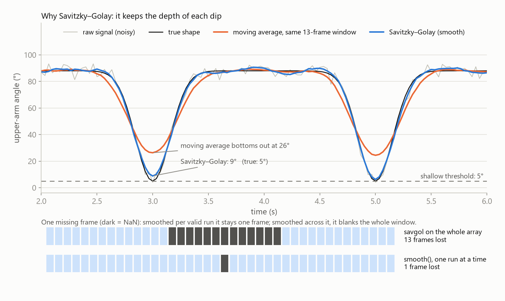

The choice of method matters most for depth. In the example, a rep that truly reaches 5°
reads **26°** after a moving average. That's well above a 5° `shallow` threshold, so a perfectly deep rep would be
reported as shallow. Savitzky–Golay reads **9°**.

Savitzky–Golay still lifts the dip by about 4° here, which is enough to cross a 5°
threshold. So the smoothing window and the `shallow` threshold can't be tuned
independently; they have to be chosen together, against the labels. (The dip in this example
is deliberately narrow; wider real dips lose less depth.)

Two details:

- **The window** is given in seconds (`window_s`) and converted to frames: `fps × window_s`,
  so 0.4 s at 30 fps is 12. `savgol_filter` needs an odd window so it has a middle frame,
  and `| 1` (bitwise OR with 1) sets the lowest bit, which makes any number odd: 12 → 13.
- **One run at a time.** A curve fitted through a window that contains a `NaN` is entirely
  `NaN`, so a single missing frame would blank the whole window around it: 13 frames in the
  bottom panel. `smooth` therefore smooths each run of valid values separately (section 7),
  and the missing frame stays one frame. Runs shorter than the window are left as they are,
  because there are too few points to fit a curve through.

---

## 11. Summary

| function | calculation | used for |
| --- | --- | --- |
| `pick_side` | compare mean visibility of each side's landmarks | measuring the limb that faces the camera |
| `angle` | arccos of (u · v) / (\|u\| \|v\|) | every joint angle |
| `elbow_angle_series` | angle at the elbow: shoulder, elbow, wrist | `no_lockout` |
| `upper_arm_angle_series` | atan2(\|dy\|, \|dx\|) of shoulder → elbow | `shallow`, and finding reps |
| `torso_tilt_series` | atan2(\|dy\|, \|dx\|) of shoulder → ankle | the in-position window |
| `hip_deviation_series` | 180° − hip angle, signed by hip y vs line y | `hip_sag`, `hip_pike` |
| `runs` | `np.diff` on a padded mask | the three functions below |
| `in_position_window` | longest run of tilt below the threshold | ignoring setup and getting up |
| `interpolate_gaps` | straight line across short interior gaps | short detection dropouts |
| `smooth` | Savitzky–Golay, one run at a time | steady threshold tests (durations), without flattening dips |

The thresholds (`max_tilt_deg`, `max_gap`, `window_s`) are required arguments rather than
defaults, so none of them is hard-coded in the module. They come from the configuration file
and are tuned against the labelled dataset.

## Regenerating the figures

From the repository root:

```
python -m scripts.make_signals_figures
```

Re-run it after changing `signals.py`, so the pictures keep showing what the code does.
